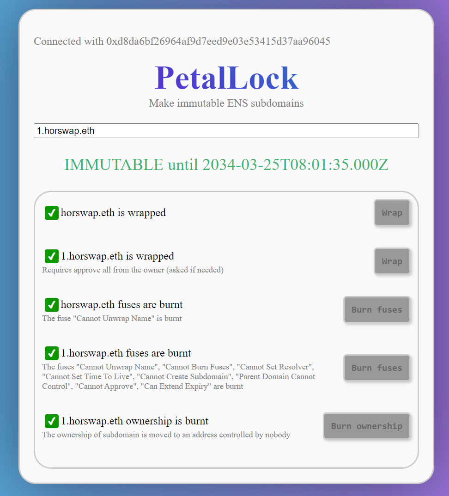

# PetalLock
PetalLock is a tool designed to create immutable ENS subdomains. Simply connect your Ethereum wallet, enter your desired ENS subdomain, and let the tool guide you through the process. The process PetalLock goes through is described in [support.ens.domains](https://support.ens.domains/en/articles/8260321-creating-and-giving-away-an-unruggable-subname).

